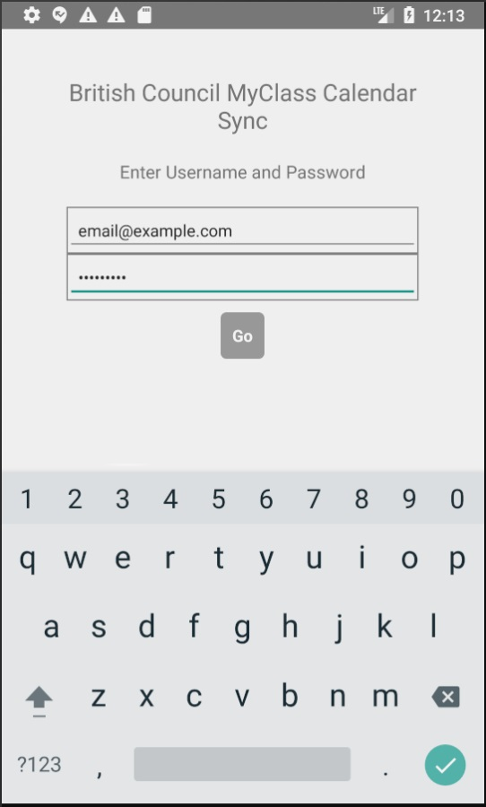

# British Council Calendar Sync

Currently deployed to [Google Play](https://play.google.com/store/apps/details?id=com.futureapp), this app is a simple demo of cross platform apps built using React Native and Clojurescript.  The app can easily be built to run on IOS and Windows Phone, instructions are available at [RE Natal](https://github.com/drapanjanas/re-natal).

The app's functionality is simple: users enter their British Council MyClass credentials.  The app makes a POST request to the login endpoint to obtain a session token and then obtains the users' class schedule from a JSON endpoint.  The classes are added to the phone's calendar.
